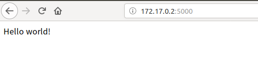

FULL NAME: AKHROROV SAADI

STUDENT ID: 15952006

### What is Docker and How to use it

Docker is a container management service. The keywords of Docker are **develop, ship** and **run** anywhere. The whole idea of Docker is for developers to easily develop  applications, ship them into containers which can then be deployed  anywhere.

First install Docker

on Linux (Ubuntu): 

```shell
$ sudo apt-get install \
    apt-transport-https \
    ca-certificates \
    curl \
    gnupg-agent \
    software-properties-common
```

Add official GPG key of docker:

```shell
$ curl -fsSL https://download.docker.com/linux/ubuntu/gpg | sudo apt-key add -
```

Verify that you now have a key with a fingerprint:

```shell
$ sudo apt-key fingerprint 0EBFCD88
   
pub   rsa4096 2017-02-22 [SCEA]
      9DC8 5822 9FC7 DD38 854A  E2D8 8D81 803C 0EBF CD88
uid           [ unknown] Docker Release (CE deb) <docker@docker.com>
sub   rsa4096 2017-02-22 [S]
```

```shell
$ sudo add-apt-repository \
   "deb [arch=amd64] https://download.docker.com/linux/ubuntu \
  $(lsb_release -cs) \
  stable"
```

Update

```shell
$ sudo apt-get update
```

```shell
$ sudo apt-get install docker-ce docker-ce-cli containerd.io
```

```shell
$ sudo apt-get install docker-ce=5:19.03.5~3-0~ubuntu-bionic docker-ce-cli=5:19.03.5~3-0~ubuntu-bionic containerd.io
```

Up until now the installation is finished, and can check the Docker version. As we can see, we have some permission problem. In fact this problem can cause other troubles when creating a new image etc. so we have to fix it first.


To fix the above problem, you just type these commands: 

```shell
$ sudo groupadd docker
$ sudo usermod -aG docker $USER
$ newgrp docker
$ sudo service docker restart
```

Now let's run our first Docker Hello World


The above output means everything is correct till now. 

With `docker` command we can get all main commands of docker 


Container usage:

If we do not have a Ubuntu image locally, we can use the docker pull command to load the Ubuntu image:

```shell
$ docker pull ubuntu
```

The following command uses the Ubuntu image to start a container. 

```shell
$ docker run -it ubuntu /bin/bash
```

In Docker, the relationship between image and container is like a class and instance of a class in OOP, i.e image is a class and container is an object. 


exit for e exiting the container. 

With these commands, we are able to check the status of the containers, their amount, ID etc.  And use `start` command + container ID to start the container, see the below image: 


with `stop` command + ID we can stop particular container, 


To enter the container we have two ways:

1. ```she
   docker attach containerID
   ```

2. ```shell
   docker exec -it containerID /bin/bash
   ```

I recommend to use the second method, because once you exit that container the container keeps running in the background. The first method stops the container after each exit. 

Export the image to the local host command: 

```shell 
$ docker export containerID > ubuntu.tar
```

Deletion of the container: 

```shell
$ docker rm -f 1e560fca3906 ##container ID
```

Running the first WEB application 


as you can see, I had connection issues at first. With use of VPN i was able to successfuly pull that. 

```shell
docker run -d -P training/webapp python app.py
```


we can see our running container. 

Above have `PORTS` column. Docker opens port number 5000 and maps it to host's 32768 port number. 

In browser  we can access demo web application



To stop the web app simply type 


Installing MySQL on Docker 


After the installation, we can run the MySQL container with the following command:

```shell
docker run -itd --name mysql-test -p 3306:3306 -e MYSQL_ROOT_PASSWORD=123456 mysql
```

here **-p 3306:3306** flag is maps 3306 port of container service to 3306 port of host. 

**MYSQL_ROOT_PASSWORD=123456** is setting a password for the root user


successfully created MySQL instance. 

Now we can access it from terminal and work with MySQL


