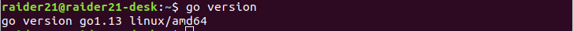

## Installing And Setting Up Go language Environment on Ubuntu 18.04 in 8 Steps    

1) Download the latest version of Go from [official website](https://golang.org/dl/)  
2) In terminal install the downloaded package with this command:  
`sudo dpkg -i <packagename.deb>`  
Another way of downloading Go is directly from the terminal, but it downloads the old version which won't work for some projects:  
`sudo apt-get install golang`  
3) Check the version:  
`go version`  
 

4) Now it's time to set the environment variables, (1) open up the terminal and type these commands:  
 `mkdir -p $HOME/go-workspace/src`    

 `mkdir -p $HOME/go-workspace/pkg`  

 `mkdir -p $HOME/go-workspace/bin`  
 (2) `sudo nano $HOME/.bashrc`  
 Paste these lines and save the file:    
`export GOROOT=/usr/local/go`    
`export GOPATH=$HOME/go-workspace`    
`export PATH=$PATH:$GOROOT/bin:$GOPATH/bin`    
  
  (3)In terminal: `source $HOME/.bashrc`  
  5) Check all the environments configurations:  
  `go env`  
    
    
6) Install [git](https://www.digitalocean.com/community/tutorials/how-to-install-git-on-ubuntu-18-04) and download `go` tools:    
`mkdir $GOPATH/src/golang.org/x/`  
`go get -d github.com/golang/tools`  
`cp $GOPATH/src/github.com/golang/tools $GOPATH/src/golang.org/x/ -rf`  
`go install golang.org/x/tools/go/buildutil`  
7) To write a code we need an editor and in this example i use VScode, Visual Studio Code is a lightweight but powerful source code editor that runs on Windows, macOS and Linux desktops. It has built-in support for JavaScript, TypeScript and Node.js, and provides a rich extended ecosystem for other languages (such as C++, C#, Java, Python, PHP, Go) and runtime (such as. NET and Unity). Just download the `.deb` package from [VScode official website](https://code.visualstudio.com/download) and do the same as in step2.  
8) And the last, we write our first `Hello World` programm and upload it to our repo on github.  
First configure github from terminal:  
`git config --global user.name "user_name"`  
`git config --global user.email "email_id"`  
In directory:`$GOPATH/src/github.com/github-user/`(github-user is your Github username) create local repo:  
`git init MyGoLangTest`  
This will create a folder MyGolangTest and `init` will initialize it as a repository.  
  
    
    
 Then we can write our code:  
 `code hello.go` -will open a VScode  
 Code:  
 ```go      
 package main      

import "fmt"    

func main() {  
    `fmt.Printf("Hello World\n")    
}   
```          
In terminal:  
`go run hello.go`  
`go install github.com/raider2107/MyGolangTest` (change your own path)  
`MyGolangTest`  
  
  
 Upload to To Github:  
 `git add .`  
 `git commit -m 'test'`  
 Then go to [github.com](https://github.com/) and create a new repository, the name must be the same as your local repository (MyGolangTest in my case). Once you created, we can push the contents of the local repo onto the GitHub repository in your profile. Connect to repository using this command:  
`git remote add origin https://github.com/user_name/Mytest.git`  
change `the user_name` to your Github username and repo name to one that you have created previously. In my case it will be:  
`git remote add origin https://github.com/raider2107/MyGolangTest.git`  
The final step is to push the local repository contents into the remote host repository (GitHub), by using the command:  
`git push origin master`  
And **finaly** enter the login credentials.   
  
 
 
  
  


 
